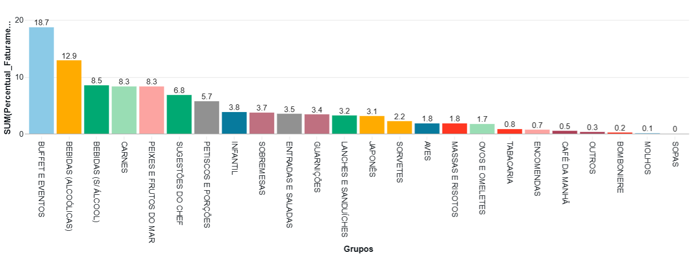
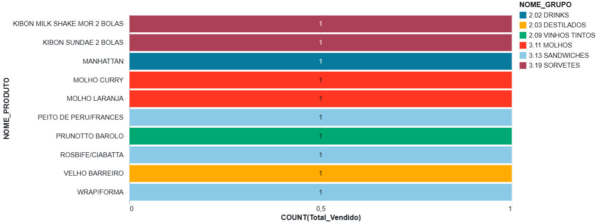
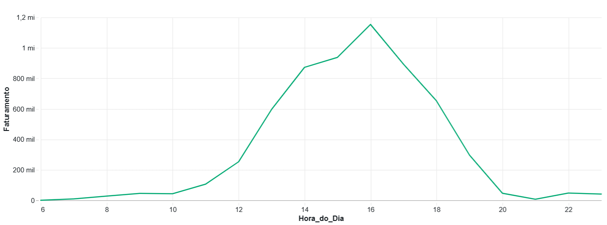
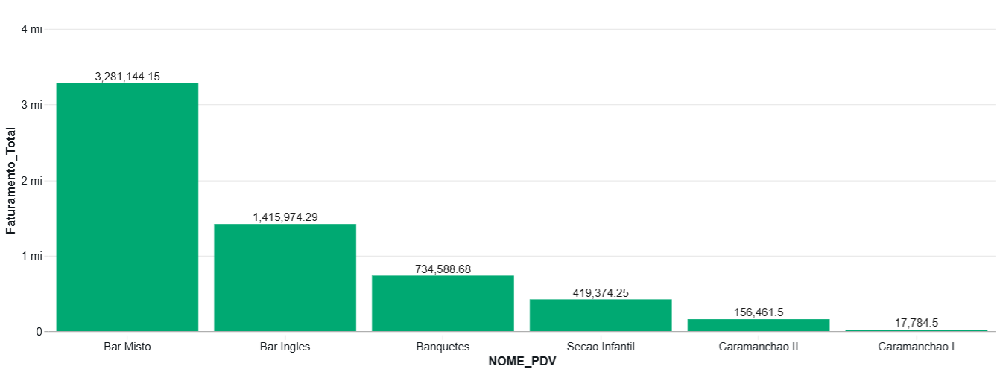
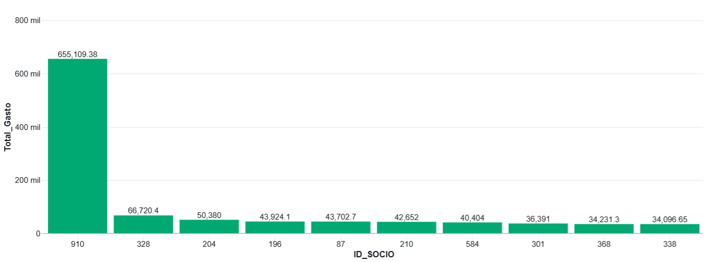
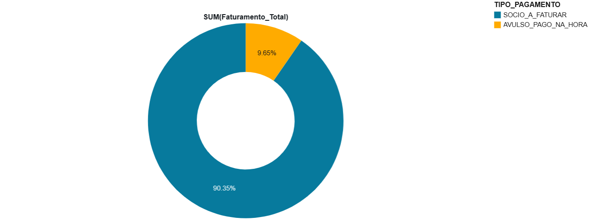

# MVP de Engenharia de Dados: Análise de Vendas para Gestão de Restaurante

## Detalhes do Projeto

* **Aluno(a):** Ursula Machado Weinstein
* **Matrícula:** 4052025000257
* **Instituição:** PUC-Rio - Pontifícia Universidade Católica do Rio de Janeiro

---

## 1. Introdução e Objetivo

Este projeto aplica conceitos fundamentais de Engenharia de Dados, focando na construção de uma arquitetura de dados (Data Warehouse) que permita a **análise de negócios** para a gestão de um restaurante. O objetivo final foi entregar uma base de dados confiável (tabela GOLD) e responder a questões estratégicas sobre Mix de Vendas, Sazonalidade e Perfil do Cliente.

O projeto foi desenhado para responder a **8 perguntas de negócio** fundamentais:

1.  **Produtos Mais Vendidos:** Quais são os 10 produtos mais vendidos (em quantidade)?
2.  **Mix de Vendas:** Dentre os diversos tipos, quais Grupos geram mais receita?
3.  **Produtos Menos Vendidos:** Quais são os 10 produtos menos vendidos?
4.  **Performance de PDV:** Qual o ranking de faturamento por Ponto de Venda?
5.  **Sazonalidade:** Qual é o faturamento por hora do dia (identificação de picos)?
6.  **Ticket Médio:** Qual é o valor médio gasto por nota fiscal?
7.  **Clientes VIP:** Quais são os 10 sócios que mais consumiram (em valor)?
8.  **Fluxo de Caixa:** Qual a divisão do faturamento total entre os tipos de consumo ("A Faturar" vs. "Pago na Hora")?
* **Período Analisado:** 01/01/2025 a 13/11/2025.

---

## 2. Estrutura do Projeto

A solução foi desenvolvida em 4 etapas sequenciais. **Observações, técnicas detalhadas, regras de negócio e a lógica de evolução encontram-se documentadas nos Markdowns de cada notebook:**

* **`Notebook 1: Camada BRONZE`:** Ingestão dos dados brutos e configuração do ambiente.
* **`Notebook 2: Camada SILVER`:** Limpeza, tipagem de dados e tratamento de nulos.
* **`Notebook 3: Camada GOLD`:** Aplicação de regras de negócio (tratamento de taxas, joins com tabela de grupos) e criação da tabela analítica.
* **`Notebook 4: Análise`:** Consultas SQL (Queries), geração de gráficos e insights de negócio respondendo às 8 perguntas do projeto.

---

## 3. Linhagem e Origem dos Dados

### 3.1. Origem dos Dados
A fonte de dados para o projeto consiste em arquivos brutos de transações de vendas extraídos do sistema de **Ponto de Venda (PDV)** da empresa onde atuo profissionalmente.

> **Nota de Consentimento:** Este projeto utiliza dados corporativos reais, cedidos pela empresa mediante **autorização da Presidência**. O dataset não contém informações sensíveis de clientes e foi utilizado exclusivamente para fins de análise técnica e demonstração acadêmica.

### 3.2. Pipeline de Transformação (Arquitetura)
A linhagem dos dados segue a arquitetura **Medallion (Bronze, Silver, Gold)** executada no ambiente **Databricks** utilizando **Spark SQL**:

1.  **Fonte:** Arquivos brutos extraídos do ERP.
2.  **Camada Bronze:** Ingestão dos dados no Data Lake sem tratamento.
3.  **Camada Silver:** Limpeza de dados, tipagem forte (casting), remoção de nulos e padronização.
4.  **Camada Gold:** Criação da tabela desnormalizada `default.gold_vendas_flat_model`, otimizada para consultas analíticas.

---

## 4. Dicionário de Dados

Especificação técnica da tabela analítica `gold_vendas_flat_model`.

| Coluna | Tipo | Descrição do Domínio | Intervalo / Valores Esperados |
| :--- | :---: | :--- | :--- |
| `DATA_HORA` | `TIMESTAMP` | Momento da transação | **Min:** 2025-01-01 / **Max:** 2025-11-13 |
| `FATURAMENTO_LIQUIDO` | `DOUBLE` | Valor líquido do item (R$) | **Min:** 0.00 (ver nota 1) / **Max:** 85181.74 |
| `QUANTIDADE` | `INT` | Unidades vendidas | **Min:** 1 / **Max:** 600* (ver nota 2) |
| `NOME_PRODUTO` | `STRING` | Item do cardápio | *Ex: CAFE EXPRESSO, HEINEKEN* |
| `NOME_GRUPO` | `STRING` | Categoria macro | *Ex: BUFFET E EVENTOS, CARNES, AVES* |
| `TIPO_PAGAMENTO` | `STRING` | Forma de pagamento | SOCIO_A_FATURAR, AVULSO_PAGO_NA_HORA |
| `NOME_PDV` | `STRING` | Local da venda | *Ex: BAR MISTO, BAR INGLES* |
| `ID_SOCIO` | `STRING` | Código do cliente | Números ou null |
| `NUM_NFCE` | `STRING` | Número da Nota Fiscal | Identificador único |
| `PRECO_UNITARIO` | `DOUBLE` | Preço de tabela de uma unidade | Ex: 8.50 |
| `VALOR_TOTAL_ITEM`| `DOUBLE` | Faturamento Bruto (Preço x Qtd) | Valor antes da aplicação de descontos |
| `FATURAMENTO_LIQUIDO` | `DOUBLE` | Faturamento Real (Total - Desconto) | Valor líquido que compõe o faturamento |

> **Nota 1 (Min):** O valor R$ 0.00 refere-se a itens de serviço (ex: Taxa de Serviço) cujos valores foram desconsiderados nesta visão para focar na análise de produtos, ou registros operacionais do sistema.
>
> **Nota 2 (Max):** Valores extremos na coluna `QUANTIDADE` referem-se a pacotes de festas ou eventos lançados em nota única, e não a erros de sistema.

---

## 5. Resultados da Análise de Negócios

A análise foi conduzida através do **Notebook 4**, gerando os seguintes insights:

### 5.1. Mix de Vendas
* **Produtos Mais Vendidos:** A lista é dominada por itens de necessidade e conveniência (Café, Água), que possuem alto giro operacional mas baixo ticket unitário.

  

* **Performance por Grupo:** O faturamento é concentrado no grupo **BUFFET E EVENTOS** e nas **Bebidas** (Alcoólicas + Não Alcoólicas), que somadas representam a segunda maior fonte de receita.

  

* **Produtos Menos Vendidos:** Todos os 10 produtos menos vendidos registraram apenas **uma única unidade vendida** em quase 11 meses.

  

### 5.2. Sazonalidade e Operação
* **Picos de Horário:** O gráfico revela um perfil de consumo vespertino. O pico máximo de faturamento ocorre às **16:00h**, seguido das 15:00h, com queda acentuada no período noturno (após 20h).

  

  
* **Concentração de PDV:** A receita é altamente dependente do **Bar Misto**, enquanto os demais pontos apresentam menor representatividade no volume total.

  

### 5.3. Perfil Financeiro e de Cliente
* **Ticket Médio:** O valor médio por transação é de **R$ 121,49**.
  
* **Clientes VIP:** Os Top 10 Sócios possuem um volume de gastos acumulado significativamente superior à média, indicando alta fidelidade e recorrência.

  

* **Fluxo de Caixa:** A operação é fortemente baseada em vendas com **cobrança posterior**. A categoria SOCIO_A_FATURAR responde por **90.4%** do faturamento líquido, enquanto o pagamento à vista (AVULSO_PAGO_NA_HORA) representa apenas 9.6%.

  

---

## 6. Conclusão

Este projeto apresentou o processamento e a análise de uma base de dados transacionais utilizando a plataforma Databricks. Através das etapas de tratamento e organização dos dados, foi possível converter registros brutos em informações estruturadas e de fácil interpretação.

Os resultados obtidos permitiram identificar padrões relevantes sobre o funcionamento da operação estudada:

* A identificação de itens com baixa rotatividade e o faturamento por Grupos;
* O mapeamento dos picos de vendas ao longo do dia, fundamentando a compreensão do fluxo de atendimento;
* A identificação da principal forma de pagamento e sua participação no faturamento total;

A estruturação dos dados facilitou a compreensão da realidade da operação. O projeto comprova que grandes volumes de registros podem ser convertidos em informações valiosas para a gestão do negócio.

---

## Autoavaliação

### 1. Objetivos atingidos
O projeto cumpriu com sucesso o objetivo de transformar dados brutos de um sistema de vendas em informações estratégicas. Através da implementação da Arquitetura Medallion, foi possível estruturar um pipeline de dados confiável que fundamentou a análise de faturamento, mix de produtos e comportamento dos clientes.

### 2. Desafios e Aprendizados
* Um dos maiores desafios foi o aprendizado da ferramenta. Como foi meu primeiro contato, precisei entender toda a dinâmica do zero.
* Lidar com dados reais exigiu um esforço significativo em limpeza e padronização. O principal desafio técnico foi realizar o enriquecimento da base através de Joins entre tabelas de vendas e de cadastros, garantindo que as categorias de produtos estivessem corretas para os insights finais.

### 3. Evolução e Trabalhos Futuros
Como passos seguintes para evolução desta solução, pretendo:
* Implementar Databricks Workflows para execução automática do pipeline.
* Implementar painéis de visualização (dashboards) para acompanhar os indicadores de vendas e o comportamento dos clientes de forma dinâmica.
